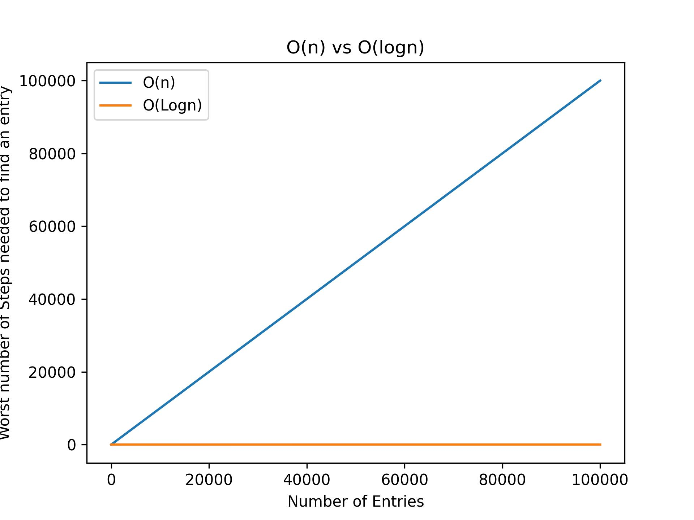

- [Binary Search](#binary-search)
- [How does it work?](#how-does-it-work)
- [How efficient is it?](#how-efficient-is-it)
- [When not to use it?](#when-not-to-use-it)

# Binary Search

Binary search is an amazing search algorithm.

Imagine that you are reading your favorite book, but forgot your bookmark and will have to remember your last read page (which was 216).
Tomorrow you are back at your book and want to open your last read page.
Well, how do you do this? I think most people would not start at the beginning: 1, 2, 3, 4 ...

No, you would probably start somewhere in the middle and check, whether your desired page is lower or higher than the one you opened.
Then you estimate againg around half to get to your page until you are there.

This is very similar to the binary search algorithm (BSA).

# How does it work?

The BSA starts in the middle of your list. It checks whether the current element is below or above your current element.

And then it starts over again by going to the half of the remaining elements. And then again. And then again.

# How efficient is it?

The BSA is unbelievably efficient compared to a linear search, in which you move one element at a time from the beginning to the end.

With a linear search you only eliminate one possible element from your list. This means a O(n) runtime, because in the worst case you will have to go through all of your n elements.

The BSA eliminates **half** of the possible elements with every step. This is a O(logn) runtime.

This gets important for very big datasets. In a list with 30 million elements you would at **maximum only need 25 steps** to find your element.

I find this quite mindblowing.

Especially if you consider, that you might otherwise need 30 million steps in worst case with linear search.

)

# When not to use it?

The limitation of binary search is, that you can only use it in already sorted lists.
